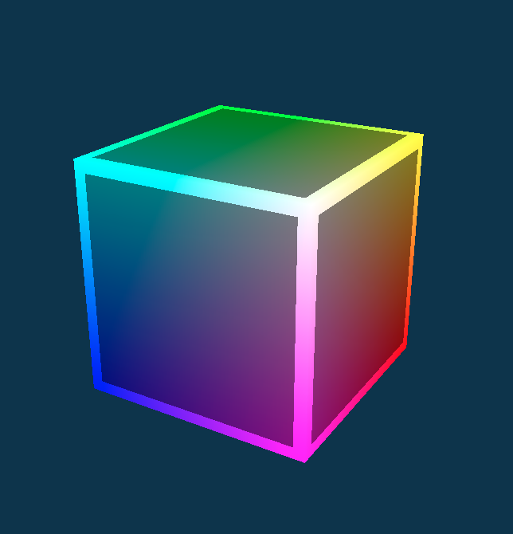

# Use.gpu

Use.GPU is a set of **reactive, declarative WebGPU legos**. It lets you compose arbitrary graphics pipelines on the fly, thanks to a built-in shader linker and binding generator.

Use.GPU is in the **alpha stage**, and continues to evolve, but the basis is very promising.

It offers components at different levels of abstraction:
- All-in 2D/3D plotting (axes, grids, curves, labels, ...)
- Data-driven geometry layers (lines, points, text, ...)
- Raw rendering tools (passes, render-to-texture, ...)

This enables completely free-form tinkering for any graphics skill level.

Use.GPU has an incremental architecture, which updates with minimal recomputation. This is done by embracing effect-based programming, with React-like memoization hooks. The result is a program that always has the same state you'd get if it was run entirely from scratch.

_For background, see:_
 - [Climbing Mount Effect](https://acko.net/blog/climbing-mt-effect/) - Effect-based programming
 - [Reconcile All The Things](https://acko.net/blog/reconcile-all-the-things/) - Memoization and reconciliation
 - [Live - Headless React](https://acko.net/blog/live-headless-react/) - Live run-time and WebGPU
 - [Frickin' Shaders with Frickin' Laser Beams](https://acko.net/blog/frickin-shaders-with-frickin-laser-beams/) - Shader closures and linker

**WebGPU is not yet available in mainline browsers, which means you need e.g. Google Chrome Dev to run the example app. You will need to turn on the `chrome://flags/#enable-unsafe-webgpu` flag.**



## Example - JSX

On the surface, Use.GPU feels exactly like React, in that you can use `<JSX>` syntax to compose its functional components. React aficionados will be right at home:

([full example](packages/app/src/pages/geometry/data.tsx))

```jsx
<Draw>
  <Pass>
    <Data
      fields={[
        ['vec4<f32>', [
          -5, -2.5, 0, 1,
          5, -2.5, 0, 1,
          0, -2.5, -5, 1,
          0, -2.5, 5, 1,
        ]],
        ['i32', [1, 2, 1, 2]],
      ]}
      render={([positions, segments]) =>
        <LineLayer
          positions={positions}
          segments={segments}
          width={5}
          depth={1}
          color={[0.125, 0.25, 0.5, 1]}
        />
      }
    />
  </Pass>
</Draw>
```

This will:
- draw a frame
- consisting of 1 render pass
- using data uploaded to the GPU
- rendered as line segments

Use.GPU has wrappers like `<WebGPU>` and `<AutoCanvas>` to set up a drawing environment, as well as a camera to define the view.

The included demo app contains various showcases of how it can be used.

## Usage

**Prerequisites**: `node`, `yarn`

**Dependencies**: run `yarn install` to grab dependent packages.

**Demo app requires Chrome Dev/Canary with WebGPU enabled.**

- `yarn start` - Run demo app at http://localhost:8777
- `yarn build` - Build packages
- `yarn test` - Run unit tests

## Packages

This repo is split into the following sub-packages:

**WebGPU**
 - `@use-gpu/core` - WebGPU helpers and types ⏱
 - `@use-gpu/webgpu` - DOM/Canvas WebGPU bindings ✅
 - `@use-gpu/text` - WASM/Rust library wrapping `ab_glyph` ✅

**Shaders**
 - `@use-gpu/shader` - WGSL/GLSL Shader linker and tree-shaker ✅
 - `@use-gpu/wgsl-loader` - WGSL file bundler for webpack and node ✅
 - `@use-gpu/glsl-loader` - GLSL file bundler for webpack and node ✅

**UI Components**
 - `@use-gpu/wgsl` - Supporting WGSL shaders ⏱
 - `@use-gpu/components` - Live components for WebGPU apps ⏱
 - `@use-gpu/app` - Testbed app ⚠️

**Live**
 - `@use-gpu/live` - Memoized effect run-time (React without DOM / rendering) ✅
 - `@use-gpu/inspect` - Debug inspector for Live ⏱
 - `@use-gpu/react` - Live/React interop ✅
 - `@use-gpu/state` - Patch/diff-based state management + hashing ✅
 
This is a work in progress. Stability:
- ✅: Stable Beta
- ⏱: Evolving Alpha
- ⚠️: Quicksand

